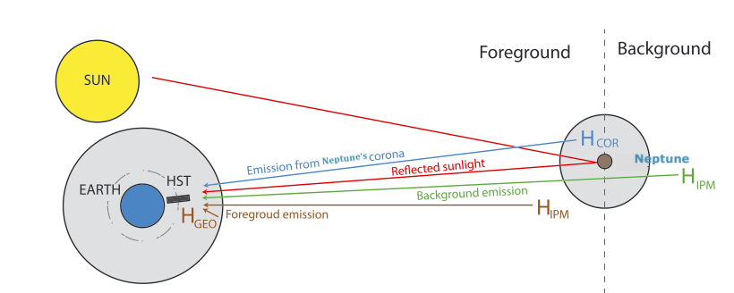

# Neptune-Project :milky_way:

 ## Project Description 
----------------------

The repo contains script which I used to analyse the Lyman-Alpha radiation emitted from the planet Neptune. The main scope of the project was indeed to analyse the flux density 
in the Lyman-Alpha band (1216 Å) which is extracted from a dataset of images withdrawed from the [Hubble Space Telescope](https://archive.stsci.edu/) (HST) archive. Atomic Hydrogen is the 
is the principal source of Ly radiation through aresonant scattering and it also happens to be the most abundant atomic species in our Universe. This implies that it is rather complicated 
to distinguish between the radiation derived directly from the atmosphere of the planet and other sources (Interplanetary Medioum, Sunlight reflected from the Planet A complete introduction on Lyman-Alpha radiation can be obtained for the
[Wikipidia](https://en.wikipedia.org/wiki/Lyman-alpha_line) page on the topic. 

 Folders
----------------------

The following table describe the content of the folders which are presented in the repo

| Folder                | Description   |
| --------------------- |:-------------:| 
| HST                   | Contains all the FITS files used in the project   | 
| Filter                | Contains tables of filters Throughputs            | 
| additional FITS files | Contains Calibration data for the HST images      |
| Images                 | Contains all the images obtained from the scripts |

 Scripts content
 ----------------------
 
 
Each script is introduces by a description of its content an the capabilities of the script itself. It is useful that you read through the descriptions given in the header of the scripts in order to understand the output given. The code is extensively commented but the project is still in progress. So some parts maybe unclear and bigger changes can occur in the nexrt future.

 What should I exopect from the scripts 
 ----------------------
 
 
The most of the scripts are able to produce display and analyse images from the Neptune observation campaign. The images are the obtained from one of the [MAMA](https://www.stsci.edu/itt/APT_help/STIS_Cycle21/c07_performance5.html) sensor (photon counter device)  installed on the HST. So the images are often expressed in terms of photon counts. It is aim of the projcet to convert the counts unit into flux unit introducing reasonable approximations and assumtions.

Useful Resouces
----------------------

Here I mention all the resources I used to obtain my datas and the artcles which I read in order to develop the project:;
1.[Hubble Space Instrumentation Handbooks](https://www.stsci.edu/hst/documentation/handbook-archive)
2.[IUE OBSERVATIONS OF NEPTUNE FOR H LYMAN-ALPHA EMISSION](file:///Users/gregorio/Desktop/stay%20foolish/Me&Neptune/material%20from%20prof/International_explor.pdf)
3.[Ultraviolet observations of Uranus and Neptune](file:///Users/gregorio/Desktop/stay%20foolish/Me&Neptune/material%20from%20prof/Ultraviolet_obs_review.pdf)
